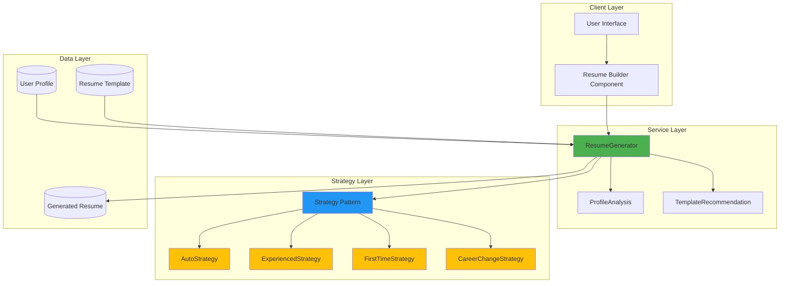
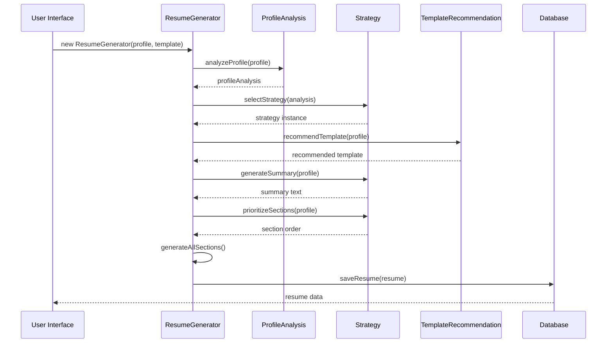
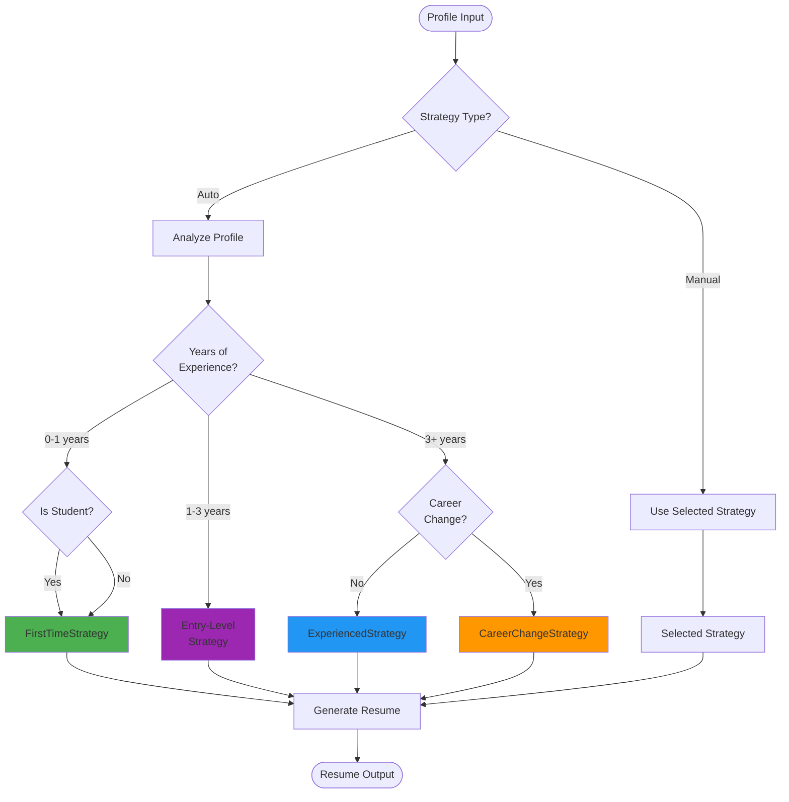
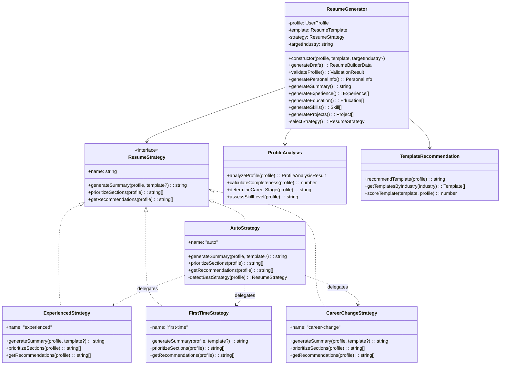

# Resume Generation Architecture

## Overview

The Digital Resume Hub uses an **Object-Oriented Programming (OOP)** architecture with the **Strategy Pattern** to generate tailored resumes based on user profiles and career stages. This architecture provides flexibility, maintainability, and extensibility for different resume generation approaches.

## Architecture Diagram



## Core Components

### 1. ResumeGenerator (Main Class)

The central orchestrator that coordinates resume generation using the Strategy Pattern.

**Responsibilities:**
- Profile validation and analysis
- Strategy selection (auto or manual)
- Template integration
- Section generation coordination
- Data transformation and formatting

**Key Features:**
- Flexible strategy selection
- Template-aware generation
- Industry targeting
- Comprehensive validation

### 2. Strategy Pattern Implementation

The Strategy Pattern allows different resume generation approaches without modifying the core generator.

**Base Strategy Interface:**
```typescript
interface ResumeStrategy {
  name: string;
  generateSummary(profile: UserProfile, template?: ResumeTemplate): string;
  prioritizeSections(profile: UserProfile): string[];
  getRecommendations(profile: UserProfile): string[];
}
```

**Available Strategies:**
- **AutoStrategy**: Automatically selects the best approach based on profile analysis
- **ExperiencedStrategy**: For professionals with 3+ years of experience
- **FirstTimeStrategy**: For students and entry-level job seekers
- **CareerChangeStrategy**: For professionals transitioning to new industries

### 3. Supporting Services

#### ProfileAnalysis
Analyzes user profiles to determine:
- Career stage (student, entry-level, mid-level, senior)
- Profile completeness score
- Missing critical information
- Skill level assessment

#### TemplateRecommendation
Recommends appropriate templates based on:
- Target industry
- Experience level
- Career stage
- Profile completeness

## Data Flow



## Strategy Selection Logic



## Class Hierarchy



## Design Patterns Used

### 1. Strategy Pattern
**Purpose**: Encapsulate different resume generation algorithms and make them interchangeable.

**Benefits:**
- Easy to add new strategies without modifying existing code
- Strategies can be selected at runtime
- Each strategy is independently testable
- Reduces conditional complexity in the main generator

### 2. Factory Pattern (Implicit)
**Purpose**: Strategy selection in `AutoStrategy` acts as a factory.

**Benefits:**
- Centralized strategy creation logic
- Encapsulates strategy selection criteria
- Easy to modify selection rules

### 3. Template Method Pattern
**Purpose**: `ResumeGenerator` defines the skeleton of resume generation.

**Benefits:**
- Consistent generation flow
- Customizable steps via strategies
- Reusable common functionality

## Key Design Decisions

### 1. Why Strategy Pattern?

**Problem**: Different users need different resume approaches:
- Students need education-focused resumes
- Experienced professionals need achievement-focused resumes
- Career changers need transferable skills emphasis

**Solution**: Strategy Pattern allows each approach to be implemented independently while sharing common infrastructure.

### 2. Why Separate ProfileAnalysis?

**Problem**: Profile analysis logic was scattered across multiple components.

**Solution**: Centralized analysis service provides:
- Consistent profile evaluation
- Reusable analysis across features
- Single source of truth for profile metrics

### 3. Why Template Integration?

**Problem**: Templates and profiles need to work together seamlessly.

**Solution**: ResumeGenerator merges template starter data with profile data:
- Templates provide structure and examples
- Profiles provide actual user data
- Generator intelligently combines both

## Performance Considerations

### Memory Efficiency
- Strategies are stateless and reusable
- Profile data is passed by reference
- Generated sections are created on-demand

### Computational Efficiency
- Profile analysis is cached per generator instance
- Strategy selection happens once per generation
- Template data is preprocessed

### Scalability
- Stateless design allows horizontal scaling
- Each generation is independent
- No shared mutable state

## Extension Points

### Adding New Strategies

1. Implement `ResumeStrategy` interface
2. Add strategy to `ResumeStrategies.ts`
3. Update `AutoStrategy` selection logic (if needed)
4. Add tests for new strategy
5. Update documentation

### Adding New Sections

1. Add section type to `ResumeBuilderData`
2. Implement generation method in `ResumeGenerator`
3. Update strategies to handle new section
4. Add section to templates
5. Update tests

### Customizing Analysis

1. Extend `ProfileAnalysis` service
2. Add new metrics or criteria
3. Update strategy selection logic
4. Add tests for new analysis

## Testing Strategy

### Unit Tests
- Each strategy independently tested
- ResumeGenerator methods tested in isolation
- ProfileAnalysis logic verified
- Edge cases and error handling

### Integration Tests
- Complete generation flow tested
- Strategy selection verified
- Template integration validated
- Multi-scenario testing

### Test Coverage Goals
- Core services: >90%
- Strategies: >85%
- Overall: >70%

## Migration from Legacy Code

The new OOP architecture replaces the previous functional approach:

**Before:**
```typescript
// Scattered functions
function generateResume(profile, template) {
  // All logic in one place
  // Hard to extend or modify
}
```

**After:**
```typescript
// Organized classes with clear responsibilities
const generator = new ResumeGenerator(profile, template);
const resume = generator.generateDraft();
```

**Benefits:**
- Better code organization
- Easier to test
- More maintainable
- Extensible without modification

## Future Enhancements

### Planned Features
1. **AI-Powered Strategies**: Integration with LLMs for content generation
2. **Industry-Specific Strategies**: Specialized strategies per industry
3. **Multi-Language Support**: Strategies for different languages
4. **A/B Testing**: Compare strategy effectiveness
5. **Personalization Engine**: Learn from user preferences

### Architectural Improvements
1. **Event System**: Emit events during generation for tracking
2. **Plugin System**: Allow third-party strategy plugins
3. **Caching Layer**: Cache generated sections for performance
4. **Async Generation**: Support for long-running AI operations

## Related Documentation

- [API Reference](./API.md) - Detailed API documentation
- [Strategy Guide](./STRATEGIES.md) - In-depth strategy documentation
- [Usage Examples](./EXAMPLES.md) - Code examples and patterns
- [Contributing Guide](./CONTRIBUTING.md) - How to contribute
- [Troubleshooting](./TROUBLESHOOTING.md) - Common issues and solutions

## Glossary

**Strategy**: An algorithm for generating resume content based on user profile characteristics.

**Profile Analysis**: The process of evaluating a user profile to determine career stage, completeness, and other metrics.

**Template**: A pre-designed resume structure with placeholder content and styling.

**Section**: A distinct part of a resume (e.g., experience, education, skills).

**Career Stage**: Classification of user's career level (student, entry-level, mid-level, senior).

**Target Industry**: The industry or field the user is applying to.
