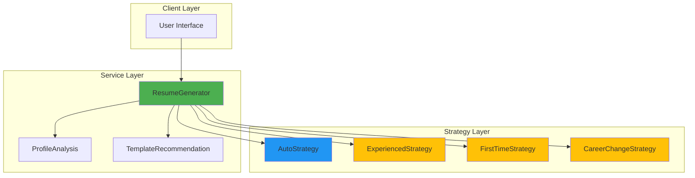

# Resume Generation System Documentation

Comprehensive documentation for the OOP-based Resume Generation architecture.

## 📚 Documentation Index

### Core Documentation

#### [Architecture Overview](./ARCHITECTURE.md)
Complete architectural overview of the resume generation system.

**Contents:**
- System architecture diagrams
- Core components explanation
- Data flow visualization
- Strategy selection logic
- Class hierarchy
- Design patterns used
- Performance characteristics
- Extension points
- Future enhancements

**Best for:** Understanding the overall system design and how components work together.

---

#### [API Reference](./API.md)
Detailed API documentation for all classes and methods.

**Contents:**
- ResumeGenerator class API
- Strategy interfaces and implementations
- ProfileAnalysis service
- TemplateRecommendation service
- Type definitions
- Method signatures and parameters
- Return types and examples
- Error handling

**Best for:** Developers integrating the resume generation system or looking up specific methods.

---

#### [Strategy Guide](./STRATEGIES.md)
In-depth guide to the Strategy Pattern implementation.

**Contents:**
- Strategy Pattern explanation
- Available strategies (Auto, Experienced, FirstTime, CareerChange)
- Strategy selection logic
- Implementation details
- Creating custom strategies
- Strategy comparison
- Best practices
- Performance considerations

**Best for:** Understanding how strategies work and when to use each one.

---

#### [Usage Examples](./EXAMPLES.md)
Practical code examples for common use cases.

**Contents:**
- Basic usage examples
- Strategy-specific examples
- Advanced usage patterns
- Integration examples (Svelte, API endpoints)
- Common patterns (validation, caching, batching)
- Error handling examples
- Real-world scenarios

**Best for:** Getting started quickly with working code examples.

---

#### [Contributing Guide](./CONTRIBUTING.md)
Guidelines for contributing to the resume generation system.

**Contents:**
- Development setup
- Adding new strategies (step-by-step)
- Code standards and conventions
- Testing requirements
- Documentation requirements
- Pull request process
- Code review guidelines

**Best for:** Contributors adding new features or strategies.

---

#### [Performance Guide](./PERFORMANCE.md)
Performance optimization strategies and best practices.

**Contents:**
- Performance metrics and goals
- Optimization strategies
- Caching implementations
- Memory management
- Profiling and monitoring
- Best practices
- Common pitfalls

**Best for:** Optimizing resume generation performance for production use.

---

#### [Troubleshooting Guide](./TROUBLESHOOTING.md)
Solutions to common issues and debugging tips.

**Contents:**
- Common issues and solutions
- Profile validation errors
- Generation failures
- Strategy selection issues
- Template problems
- Performance issues
- Data format issues
- Debugging tips

**Best for:** Solving problems and debugging issues.

---

## 🚀 Quick Start

### 1. Basic Resume Generation

```typescript
import { ResumeGenerator } from '$lib/services/ResumeGenerator';

// Load profile and template
const profile = await loadUserProfile(userId);
const template = await loadTemplate('professional');

// Generate resume
const generator = new ResumeGenerator(profile, template);
const resume = generator.generateDraft();

console.log(resume.personalInfo.name);
console.log(resume.summary);
```

### 2. With Validation

```typescript
const generator = new ResumeGenerator(profile, template);

// Validate first
const validation = generator.validateProfile();
if (!validation.isValid) {
  console.error('Validation errors:', validation.errors);
  return;
}

// Generate
const resume = generator.generateDraft();
```

### 3. Using Specific Strategy

```typescript
import { ExperiencedStrategy } from '$lib/services/ResumeStrategies';

const strategy = new ExperiencedStrategy();
const summary = strategy.generateSummary(profile, template);
const sections = strategy.prioritizeSections(profile);
```

**See [Usage Examples](./EXAMPLES.md) for more detailed examples.**

---

## 📖 Learning Path

### For New Users

1. **Start here:** [Architecture Overview](./ARCHITECTURE.md) - Understand the system
2. **Then read:** [Usage Examples](./EXAMPLES.md) - See working code
3. **Reference:** [API Reference](./API.md) - Look up specific methods
4. **If stuck:** [Troubleshooting Guide](./TROUBLESHOOTING.md) - Find solutions

### For Contributors

1. **Start here:** [Architecture Overview](./ARCHITECTURE.md) - Understand design
2. **Then read:** [Strategy Guide](./STRATEGIES.md) - Learn strategy pattern
3. **Follow:** [Contributing Guide](./CONTRIBUTING.md) - Development process
4. **Reference:** [API Reference](./API.md) - Understand interfaces

### For Performance Optimization

1. **Start here:** [Performance Guide](./PERFORMANCE.md) - Learn optimization
2. **Reference:** [Architecture Overview](./ARCHITECTURE.md) - Understand bottlenecks
3. **Use:** [Troubleshooting Guide](./TROUBLESHOOTING.md) - Debug issues

---

## 🎯 Common Tasks

### Generate a Resume

**Quick:** [Usage Examples - Basic Usage](./EXAMPLES.md#basic-usage)

**Detailed:** [API Reference - ResumeGenerator](./API.md#resumegenerator)

### Add a New Strategy

**Guide:** [Contributing Guide - Adding New Strategies](./CONTRIBUTING.md#adding-new-strategies)

**Reference:** [Strategy Guide - Creating Custom Strategies](./STRATEGIES.md#creating-custom-strategies)

### Optimize Performance

**Guide:** [Performance Guide - Optimization Strategies](./PERFORMANCE.md#optimization-strategies)

**Examples:** [Performance Guide - Caching](./PERFORMANCE.md#caching)

### Debug an Issue

**Start:** [Troubleshooting Guide - Common Issues](./TROUBLESHOOTING.md#common-issues)

**Tips:** [Troubleshooting Guide - Debugging Tips](./TROUBLESHOOTING.md#debugging-tips)

---

## 🏗️ Architecture at a Glance



**See [Architecture Overview](./ARCHITECTURE.md) for detailed diagrams.**

---

## 🔑 Key Concepts

### Strategy Pattern

The system uses the **Strategy Pattern** to provide different resume generation approaches:

- **AutoStrategy**: Automatically selects best approach
- **ExperiencedStrategy**: For professionals with 3+ years
- **FirstTimeStrategy**: For students and entry-level
- **CareerChangeStrategy**: For career transitions

**Learn more:** [Strategy Guide](./STRATEGIES.md)

### Profile Analysis

Analyzes user profiles to determine:
- Career stage
- Years of experience
- Profile completeness
- Recommended strategy

**Learn more:** [API Reference - ProfileAnalysis](./API.md#profileanalysis)

### Template Integration

Merges template starter data with user profile data:
- Templates provide structure
- Profiles provide actual data
- Generator combines intelligently

**Learn more:** [Architecture Overview - Template Integration](./ARCHITECTURE.md#why-template-integration)

---

## 📊 Performance Characteristics

| Operation | Typical Time | Notes |
|-----------|-------------|-------|
| Profile Validation | <5ms | Fast, synchronous |
| Strategy Selection | <10ms | Includes analysis |
| Summary Generation | 10-50ms | Varies by complexity |
| Complete Resume | 50-200ms | All sections |

**Learn more:** [Performance Guide](./PERFORMANCE.md)

---

## 🧪 Testing

### Test Coverage

- **Core Services:** >90%
- **Strategies:** >85%
- **Overall:** >70%

### Running Tests

```bash
# Run all tests
npm test

# Run with coverage
npm test -- --coverage

# Run specific test file
npm test -- ResumeGenerator.test.ts

# Watch mode
npm test -- --watch
```

**Learn more:** [Contributing Guide - Testing Requirements](./CONTRIBUTING.md#testing-requirements)

---

## 🤝 Contributing

We welcome contributions! Here's how to get started:

1. **Read:** [Contributing Guide](./CONTRIBUTING.md)
2. **Setup:** Follow development setup instructions
3. **Code:** Follow code standards and conventions
4. **Test:** Write tests for new code (90%+ coverage)
5. **Document:** Update relevant documentation
6. **Submit:** Create pull request with clear description

**See [Contributing Guide](./CONTRIBUTING.md) for detailed instructions.**

---

## 🐛 Troubleshooting

### Common Issues

- **Empty sections:** [Profile data not parsed](./TROUBLESHOOTING.md#resume-generation-returns-empty-sections)
- **Validation errors:** [Missing required fields](./TROUBLESHOOTING.md#profile-validation-failed-missing-required-fields)
- **Wrong strategy:** [Strategy selection issues](./TROUBLESHOOTING.md#autostrategy-selects-wrong-strategy)
- **Slow generation:** [Performance problems](./TROUBLESHOOTING.md#slow-resume-generation)

**See [Troubleshooting Guide](./TROUBLESHOOTING.md) for solutions.**

---

## 📞 Getting Help

### Resources

- **Documentation:** You're reading it!
- **Examples:** [Usage Examples](./EXAMPLES.md)
- **Troubleshooting:** [Troubleshooting Guide](./TROUBLESHOOTING.md)

### Support

- **GitHub Issues:** Report bugs or request features
- **GitHub Discussions:** Ask questions and share ideas
- **Email:** support@resumehub.com

---

## 📝 Version History

### v1.0.0 (2024-01)

**Initial Release:**
- OOP architecture with Strategy Pattern
- Four resume generation strategies
- ProfileAnalysis service
- TemplateRecommendation service
- Comprehensive test coverage (>70%)
- Complete documentation

**Features:**
- Automatic strategy selection
- Profile validation
- Template integration
- Section generation
- Skill categorization
- Performance optimization

---

## 📄 License

This project is licensed under the MIT License. See LICENSE file for details.

---

## 🙏 Acknowledgments

Built with:
- TypeScript
- Vitest (testing)
- Mermaid (diagrams)

Special thanks to all contributors!

---

## 📚 Additional Resources

### External Links

- [Strategy Pattern (Refactoring Guru)](https://refactoring.guru/design-patterns/strategy)
- [TypeScript Documentation](https://www.typescriptlang.org/docs/)
- [Vitest Documentation](https://vitest.dev/)

### Related Projects

- Resume Builder UI Components
- Template Editor
- Profile Management System

---

**Last Updated:** January 2024

**Maintained by:** Digital Resume Hub Team

**Questions?** Open an issue or start a discussion on GitHub!
