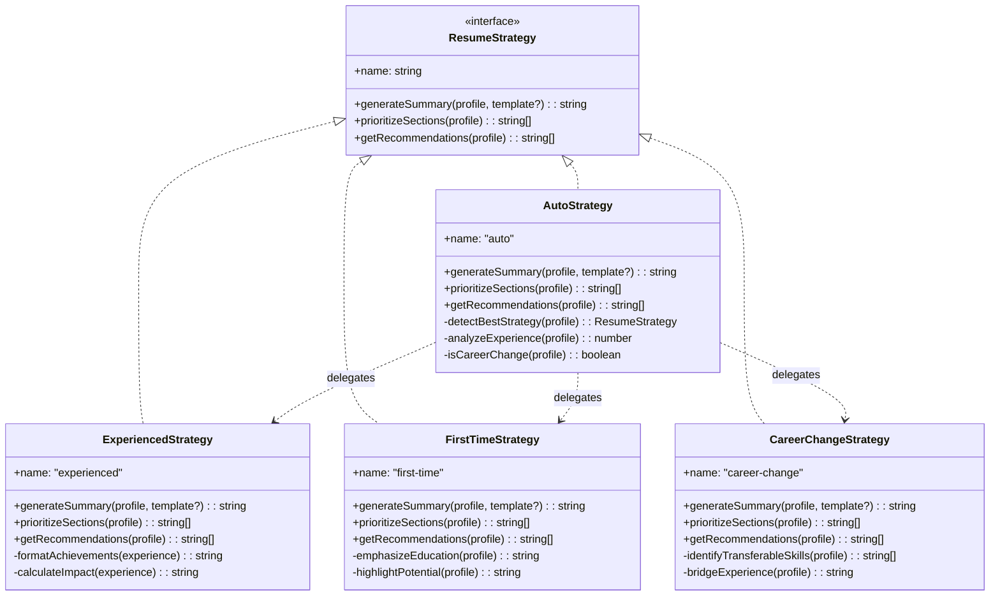
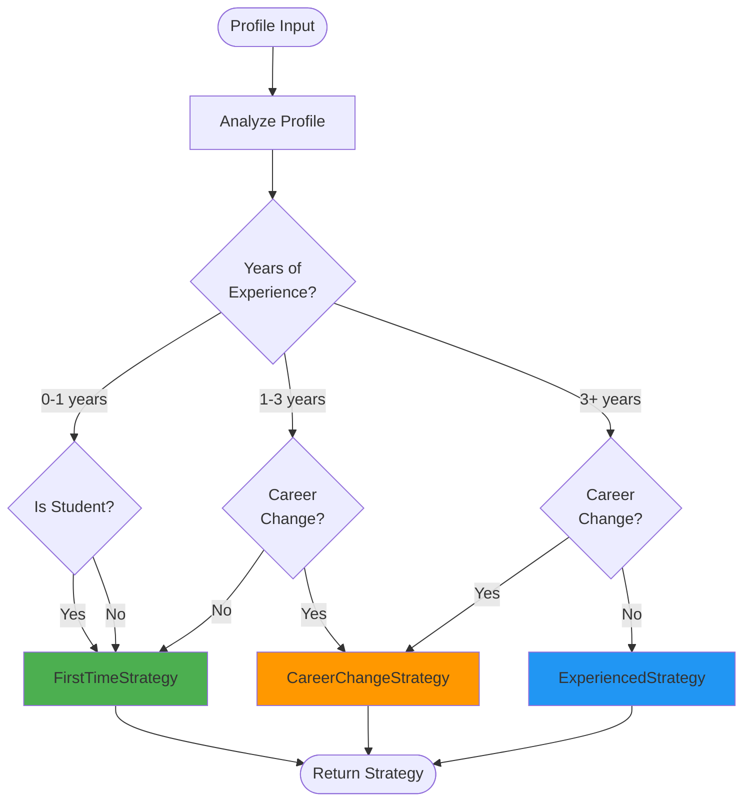
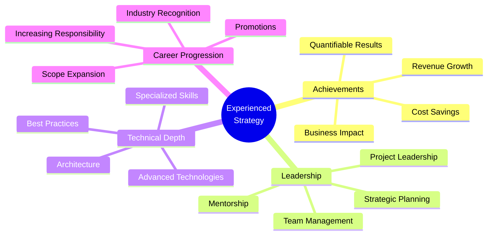
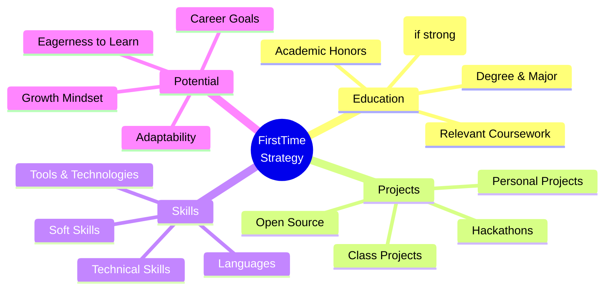
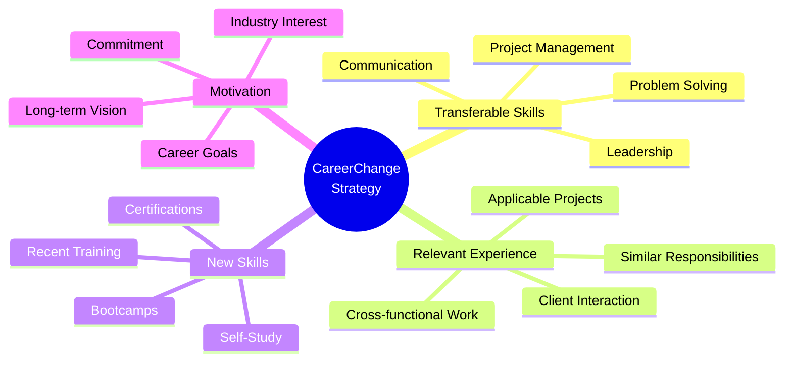

# Resume Generation Strategies

Comprehensive guide to the Strategy Pattern implementation in the Resume Generation system.

## Table of Contents

- [Overview](#overview)
- [Strategy Pattern](#strategy-pattern)
- [Available Strategies](#available-strategies)
- [Strategy Selection](#strategy-selection)
- [Implementation Details](#implementation-details)
- [Creating Custom Strategies](#creating-custom-strategies)

---

## Overview

The Resume Generation system uses the **Strategy Pattern** to provide different approaches for generating resume content based on user career stages and goals. Each strategy implements a common interface but provides unique logic for content generation, section prioritization, and recommendations.

## Strategy Pattern

### What is the Strategy Pattern?

The Strategy Pattern is a behavioral design pattern that:
- Defines a family of algorithms (strategies)
- Encapsulates each algorithm
- Makes algorithms interchangeable at runtime

### Why Use It?

**Problems Solved:**
1. **Conditional Complexity**: Eliminates large if/else or switch statements
2. **Code Duplication**: Shares common infrastructure while varying behavior
3. **Extensibility**: Easy to add new strategies without modifying existing code
4. **Testability**: Each strategy can be tested independently

### Class Diagram



---

## Available Strategies

### 1. AutoStrategy

**Purpose**: Automatically selects the most appropriate strategy based on profile analysis.

**When to Use:**
- Default choice for most users
- When user career stage is unclear
- For general-purpose resume generation

**Selection Logic:**



**Example:**

```typescript
import { AutoStrategy } from '$lib/services/ResumeStrategies';

const strategy = new AutoStrategy();

// Automatically detects best approach
const summary = strategy.generateSummary(profile, template);
const sections = strategy.prioritizeSections(profile);
const recommendations = strategy.getRecommendations(profile);
```

**Characteristics:**
- **Adaptive**: Changes behavior based on profile
- **Intelligent**: Uses multiple criteria for selection
- **Delegating**: Forwards to specialized strategies
- **Transparent**: Returns recommendations from selected strategy

---

### 2. ExperiencedStrategy

**Purpose**: Optimized for professionals with 3+ years of experience.

**Target Audience:**
- Mid-level professionals (3-7 years)
- Senior professionals (7-15 years)
- Executives (15+ years)

**Focus Areas:**



**Summary Generation:**

```typescript
generateSummary(profile: UserProfile, template?: ResumeTemplate): string {
  const years = this.calculateYearsOfExperience(profile);
  const expertise = this.extractExpertise(profile);
  const achievements = this.highlightAchievements(profile);
  
  return `${profile.experience_level || 'Experienced'} professional with ${years}+ years 
          of expertise in ${expertise}. ${achievements} Proven track record of delivering 
          high-impact solutions and leading successful projects.`;
}
```

**Section Priority:**
1. **Experience** (Primary focus)
2. **Skills** (Technical depth)
3. **Education** (Foundation)
4. **Projects** (Additional work)
5. **Certifications** (Credentials)

**Recommendations:**

```typescript
getRecommendations(profile: UserProfile): string[] {
  return [
    'Quantify achievements with metrics (e.g., "Increased revenue by 40%")',
    'Highlight leadership and mentorship experience',
    'Emphasize technical expertise and specializations',
    'Include notable projects and their business impact',
    'Mention any industry recognition or awards'
  ];
}
```

**Example Output:**

```
PROFESSIONAL SUMMARY
Senior Software Engineer with 8+ years of expertise in full-stack development 
and cloud architecture. Led development of microservices platform serving 10M+ 
users, resulting in 60% reduction in deployment time. Proven track record of 
delivering high-impact solutions and mentoring engineering teams.

EXPERIENCE
Senior Software Engineer | Tech Corp | 2020 - Present
• Architected and implemented microservices platform serving 10M+ users
• Reduced deployment time by 60% through CI/CD automation
• Mentored team of 5 junior developers, improving code quality by 40%
• Led migration to Kubernetes, reducing infrastructure costs by $200K annually
```

---

### 3. FirstTimeStrategy

**Purpose**: Optimized for students and entry-level job seekers with limited professional experience.

**Target Audience:**
- Current students
- Recent graduates
- Career starters (0-2 years)
- Interns seeking full-time roles

**Focus Areas:**



**Summary Generation:**

```typescript
generateSummary(profile: UserProfile, template?: ResumeTemplate): string {
  const degree = this.extractDegree(profile);
  const skills = this.extractKeySkills(profile);
  const interests = profile.target_industry || 'technology';
  
  return `Motivated ${degree} graduate with strong foundation in ${skills}. 
          Passionate about ${interests} and eager to apply technical skills 
          in a professional environment. Quick learner with proven ability 
          to deliver quality work through academic and personal projects.`;
}
```

**Section Priority:**
1. **Education** (Primary credential)
2. **Projects** (Demonstrate skills)
3. **Skills** (Technical abilities)
4. **Experience** (Internships, part-time)
5. **Certifications** (Additional learning)

**Recommendations:**

```typescript
getRecommendations(profile: UserProfile): string[] {
  return [
    'Highlight relevant coursework and academic projects',
    'Include GPA if 3.5 or higher',
    'Emphasize technical skills and tools learned',
    'Showcase personal projects with GitHub links',
    'Mention internships, volunteer work, or extracurricular activities',
    'Focus on potential and eagerness to learn'
  ];
}
```

**Example Output:**

```
PROFESSIONAL SUMMARY
Motivated Computer Science graduate with strong foundation in full-stack 
development and data structures. Passionate about software engineering and 
eager to apply technical skills in a professional environment. Quick learner 
with proven ability to deliver quality work through academic and personal projects.

EDUCATION
Bachelor of Science in Computer Science | University of California | 2024
GPA: 3.8/4.0
Relevant Coursework: Data Structures, Algorithms, Web Development, Database Systems
Honors: Dean's List (4 semesters), CS Department Award

PROJECTS
E-Commerce Platform | Personal Project | 2023
• Built full-stack e-commerce application using React, Node.js, and MongoDB
• Implemented user authentication, shopping cart, and payment integration
• Deployed on AWS with CI/CD pipeline
• GitHub: github.com/user/ecommerce-platform
```

---

### 4. CareerChangeStrategy

**Purpose**: Optimized for professionals transitioning to a new industry or role.

**Target Audience:**
- Career changers
- Industry switchers
- Role transitioners
- Professionals pivoting careers

**Focus Areas:**



**Summary Generation:**

```typescript
generateSummary(profile: UserProfile, template?: ResumeTemplate): string {
  const previousField = this.extractPreviousField(profile);
  const targetField = profile.target_industry || 'new field';
  const transferableSkills = this.identifyTransferableSkills(profile);
  
  return `${profile.experience_level || 'Experienced'} professional transitioning 
          from ${previousField} to ${targetField}. Bringing ${transferableSkills} 
          and proven track record of success. Recently completed [relevant training] 
          to build technical foundation. Committed to leveraging diverse background 
          to bring fresh perspective and drive innovation.`;
}
```

**Section Priority:**
1. **Skills** (Transferable + New)
2. **Experience** (Relevant aspects highlighted)
3. **Education** (New training first)
4. **Projects** (In new field)
5. **Certifications** (New field credentials)

**Recommendations:**

```typescript
getRecommendations(profile: UserProfile): string[] {
  return [
    'Emphasize transferable skills from previous career',
    'Highlight relevant aspects of past experience',
    'Showcase new skills and certifications in target field',
    'Include projects or portfolio work in new industry',
    'Explain motivation for career change in summary',
    'Connect past achievements to future goals'
  ];
}
```

**Example Output:**

```
PROFESSIONAL SUMMARY
Experienced educator transitioning to UX design. Bringing strong communication, 
user empathy, and problem-solving skills developed through 5 years of teaching. 
Recently completed Google UX Design Certificate and built portfolio of 3 case 
studies. Committed to leveraging diverse background to create intuitive, 
accessible user experiences.

SKILLS
UX/UI Design: Figma, Adobe XD, Sketch, Prototyping, User Research
Transferable: Communication, Presentation, Empathy, Problem Solving, Collaboration
Technical: HTML, CSS, JavaScript (learning), Responsive Design

EXPERIENCE
High School Teacher | Lincoln High School | 2018 - 2023
• Designed and delivered engaging curriculum for 150+ students
• Conducted user research through student feedback and assessments
• Iterated on teaching methods based on data and student needs
• Collaborated with cross-functional teams on school-wide initiatives
```

---

## Strategy Selection

### Automatic Selection (AutoStrategy)

The `AutoStrategy` uses the following criteria to select the best strategy:

```typescript
private detectBestStrategy(profile: UserProfile): ResumeStrategy {
  const yearsOfExperience = this.analyzeExperience(profile);
  const isCareerChange = this.isCareerChange(profile);
  const isStudent = this.isStudent(profile);
  
  // Career change takes precedence
  if (isCareerChange) {
    return new CareerChangeStrategy();
  }
  
  // Student or entry-level
  if (isStudent || yearsOfExperience < 2) {
    return new FirstTimeStrategy();
  }
  
  // Experienced professional
  if (yearsOfExperience >= 3) {
    return new ExperiencedStrategy();
  }
  
  // Default to first-time for unclear cases
  return new FirstTimeStrategy();
}
```

### Manual Selection

You can manually specify a strategy:

```typescript
import { ResumeGenerator } from '$lib/services/ResumeGenerator';
import { ExperiencedStrategy } from '$lib/services/ResumeStrategies';

// Create generator with specific strategy
const generator = new ResumeGenerator(profile, template);
generator.strategy = new ExperiencedStrategy();

// Or use strategy directly
const strategy = new ExperiencedStrategy();
const summary = strategy.generateSummary(profile, template);
```

---

## Implementation Details

### Strategy Interface

All strategies must implement this interface:

```typescript
interface ResumeStrategy {
  // Strategy identifier
  name: string;
  
  // Generate professional summary
  generateSummary(
    profile: UserProfile, 
    template?: ResumeTemplate
  ): string;
  
  // Determine optimal section order
  prioritizeSections(profile: UserProfile): string[];
  
  // Provide improvement recommendations
  getRecommendations(profile: UserProfile): string[];
}
```

### Base Implementation Pattern

```typescript
export class ExampleStrategy implements ResumeStrategy {
  name = 'example';
  
  generateSummary(profile: UserProfile, template?: ResumeTemplate): string {
    // 1. Extract relevant data from profile
    const data = this.extractData(profile);
    
    // 2. Use template context if available
    const context = template?.starterData?.summary || '';
    
    // 3. Generate strategy-specific content
    const content = this.generateContent(data, context);
    
    // 4. Return formatted summary
    return content.trim();
  }
  
  prioritizeSections(profile: UserProfile): string[] {
    // Return sections in priority order
    return ['section1', 'section2', 'section3'];
  }
  
  getRecommendations(profile: UserProfile): string[] {
    // Analyze profile and return recommendations
    const recommendations: string[] = [];
    
    if (this.needsImprovement(profile)) {
      recommendations.push('Improvement suggestion');
    }
    
    return recommendations;
  }
  
  // Private helper methods
  private extractData(profile: UserProfile): any {
    // Extract and process data
  }
  
  private generateContent(data: any, context: string): string {
    // Generate content
  }
  
  private needsImprovement(profile: UserProfile): boolean {
    // Check if improvement needed
  }
}
```

---

## Creating Custom Strategies

### Step 1: Define Strategy Class

```typescript
import type { ResumeStrategy, UserProfile, ResumeTemplate } from '$lib/types';

export class CustomStrategy implements ResumeStrategy {
  name = 'custom';
  
  generateSummary(profile: UserProfile, template?: ResumeTemplate): string {
    // Your custom logic here
    return 'Custom summary';
  }
  
  prioritizeSections(profile: UserProfile): string[] {
    // Your custom section order
    return ['experience', 'skills', 'education'];
  }
  
  getRecommendations(profile: UserProfile): string[] {
    // Your custom recommendations
    return ['Custom recommendation'];
  }
}
```

### Step 2: Add to ResumeStrategies.ts

```typescript
// In ResumeStrategies.ts
export { CustomStrategy } from './CustomStrategy';

// Update AutoStrategy if needed
private detectBestStrategy(profile: UserProfile): ResumeStrategy {
  // Add logic to select your custom strategy
  if (this.shouldUseCustomStrategy(profile)) {
    return new CustomStrategy();
  }
  // ... existing logic
}
```

### Step 3: Write Tests

```typescript
import { describe, it, expect } from 'vitest';
import { CustomStrategy } from './CustomStrategy';
import { testProfile } from '../tests/fixtures/profiles';

describe('CustomStrategy', () => {
  const strategy = new CustomStrategy();
  
  it('should generate appropriate summary', () => {
    const summary = strategy.generateSummary(testProfile);
    expect(summary).toContain('expected content');
  });
  
  it('should prioritize sections correctly', () => {
    const sections = strategy.prioritizeSections(testProfile);
    expect(sections[0]).toBe('experience');
  });
  
  it('should provide relevant recommendations', () => {
    const recommendations = strategy.getRecommendations(testProfile);
    expect(recommendations.length).toBeGreaterThan(0);
  });
});
```

### Step 4: Update Documentation

Add your strategy to this document with:
- Purpose and target audience
- Focus areas
- Example output
- When to use it

---

## Strategy Comparison

| Feature | Auto | Experienced | FirstTime | CareerChange |
|---------|------|-------------|-----------|--------------|
| **Target Audience** | All users | 3+ years exp | Students/Entry | Career changers |
| **Primary Focus** | Adaptive | Achievements | Education | Transferable skills |
| **Summary Style** | Varies | Impact-driven | Potential-focused | Bridge-building |
| **Section Priority** | Varies | Experience first | Education first | Skills first |
| **Best For** | General use | Professionals | Graduates | Transitions |
| **Complexity** | High | Medium | Low | Medium |

---

## Best Practices

### 1. Strategy Selection

```typescript
// ✅ Good: Let AutoStrategy decide for most cases
const generator = new ResumeGenerator(profile, template);

// ✅ Good: Manual selection for specific needs
const strategy = new ExperiencedStrategy();
const summary = strategy.generateSummary(profile);

// ❌ Avoid: Hardcoding strategy without analysis
const strategy = new ExperiencedStrategy(); // May not fit user
```

### 2. Content Generation

```typescript
// ✅ Good: Use profile data as primary source
const summary = strategy.generateSummary(profile, template);

// ✅ Good: Fallback to template when profile incomplete
const summary = profile.professional_summary || 
                template.starterData?.summary || 
                strategy.generateSummary(profile);

// ❌ Avoid: Ignoring profile data
const summary = template.starterData?.summary; // Misses user data
```

### 3. Recommendations

```typescript
// ✅ Good: Provide actionable, specific recommendations
recommendations.push('Add 2-3 quantifiable achievements to each role');

// ❌ Avoid: Vague recommendations
recommendations.push('Improve your resume'); // Not actionable
```

---

## Performance Considerations

### Strategy Instantiation

```typescript
// ✅ Good: Reuse strategy instances
const strategy = new ExperiencedStrategy();
const summary1 = strategy.generateSummary(profile1);
const summary2 = strategy.generateSummary(profile2);

// ❌ Avoid: Creating new instances unnecessarily
const summary1 = new ExperiencedStrategy().generateSummary(profile1);
const summary2 = new ExperiencedStrategy().generateSummary(profile2);
```

### Profile Analysis Caching

```typescript
// ✅ Good: Cache analysis results
const analysis = ProfileAnalysis.analyzeProfile(profile);
const strategy = this.selectStrategy(analysis);
const recommendations = this.getRecommendations(analysis);

// ❌ Avoid: Repeated analysis
const strategy = this.selectStrategy(ProfileAnalysis.analyzeProfile(profile));
const recommendations = this.getRecommendations(ProfileAnalysis.analyzeProfile(profile));
```

---

## Troubleshooting

### Strategy Not Selecting Correctly

**Problem**: AutoStrategy selects wrong strategy for user

**Solution**:
1. Check profile data completeness
2. Verify experience calculation logic
3. Review career change detection
4. Consider manual strategy selection

### Summary Generation Issues

**Problem**: Generated summary doesn't match user profile

**Solution**:
1. Verify profile data is populated
2. Check template context
3. Review strategy logic
4. Test with different profiles

### Section Priority Problems

**Problem**: Sections appear in wrong order

**Solution**:
1. Check strategy's `prioritizeSections()` method
2. Verify profile analysis
3. Review section generation logic
4. Test with various profiles

---

## See Also

- [Architecture Overview](./ARCHITECTURE.md)
- [API Reference](./API.md)
- [Usage Examples](./EXAMPLES.md)
- [Contributing Guide](./CONTRIBUTING.md)
